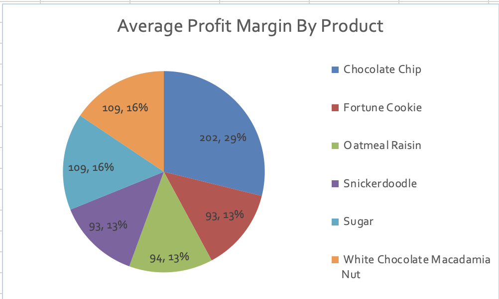
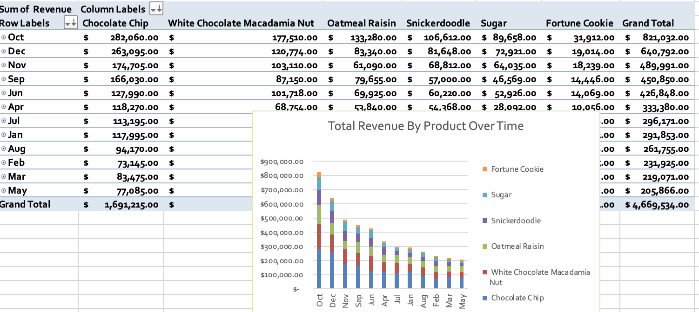
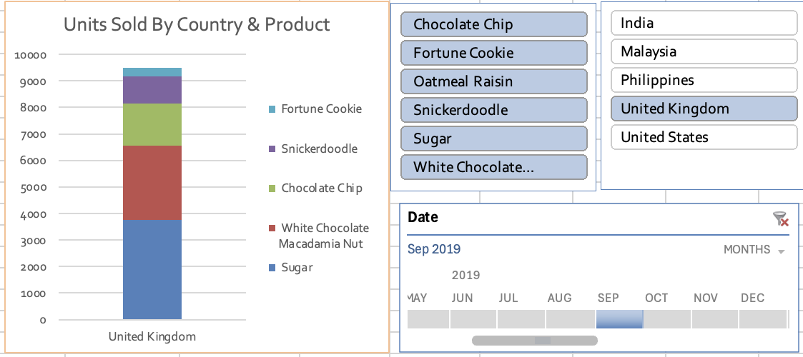

# Excel Dashboard Project: Building an Interactive Sales Dashboard

## Objective

Create a dynamic and interactive sales dashboard using 5 Pivot Tables, each providing a unique data summary, and 5 corresponding visuals. Leverage advanced Excel features like Slicers, Timelines, and Calculated Columns to present meaningful insights.

## Dataset Overview

| Column        | Description                                     |
|---------------|-------------------------------------------------|
| Country       | Country where the sale occurred.              |
| Product       | Name of the product sold.                      |
| Units Sold    | Number of units sold.                           |
| Total Cost    | Total cost of the units sold.                   |
| Total Profit  | Total profit from the units sold.                |
| Date          | Date of the sale.                               |

## Instructions

### 1. Creating Calculated Columns

*   **Profit Margin:** `(Total Profit / Total Cost) * 100`
*   **Revenue:** `Total Cost + Total Profit`

### 2. Create 5 Pivot Tables and Summarize Data

**Pivot Table 1: Total Revenue by Country**

*   Rows: Country
*   Values: Revenue (Sum)

**Pivot Table 2: Total Units Sold by Product**

*   Rows: Product
*   Values: Units Sold (Sum)

**Pivot Table 3: Average Profit Margin by Product**

*   Rows: Product
*   Values: Profit Margin (Average)

**Pivot Table 4: Total Revenue by Product over Time**

*   Rows: Date (Grouped by Month/Year)
*   Columns: Product
*   Values: Revenue (Sum)

**Pivot Table 5: Units Sold by Country and Product**

*   Rows: Country
*   Columns: Product
*   Values: Units Sold (Sum)

### 3. Add Slicers

*   Slicer for Country
*   Slicer for Product

### 4. Add a Timeline

*   Timeline based on the Date column.

### 5. Visualizing the Pivot Tables with 5 Charts

**Visual 1: Total Revenue by Country (Bar Chart)**

*   Based on Pivot Table 1.

**Visual 2: Total Units Sold by Product (Column Chart)**

*   Based on Pivot Table 2.
  

  

  

**Visual 3: Average Profit Margin by Product (Pie Chart)**

*   Based on Pivot Table 3.
  

  
  
  

**Visual 4: Total Revenue by Product Over Time (Line Chart)**

*   Based on Pivot Table 4.
  

  

  

**Visual 5: Units Sold by Country and Product (Stacked Column Chart)**

*   Based on Pivot Table 5.
  

  

  

### Advanced Features

*   **Conditional Formatting:** Apply color scales to Profit Margin and Revenue in Pivot Tables.
*   **Dynamic Interactivity:** Ensure all charts are linked to Slicers and Timeline.
*   **Calculated Fields (Optional):** Explore metrics like Profit Growth Rate or Average Revenue per Unit Sold.

## Deliverable

An Excel file containing:

1.  5 Pivot Tables.
2.  Slicers for Country and Product.
3.  Timeline for Date filtering.
4.  5 Visuals (Bar, Column, Pie, Line, Stacked Column).
5.  Conditional Formatting.
6.  (Optional) Calculated Fields.

## General Recommendations for Dashboard Design

*   **User-Friendly Layout:** Organize visuals logically.
*   **Consistent Formatting:** Use consistent colors, fonts, and styles.
*   **Storytelling with Data:** Add annotations or titles explaining key takeaways.
*   **Regular Updates:** Refresh the dataset regularly.

## Final Deliverable Checklist

*   [ ] 5 Pivot Tables
*   [ ] Slicers
*   [ ] Timeline
*   [ ] 5 Visuals
*   [ ] Conditional Formatting
*   [ ] (Optional) Calculated Fields
