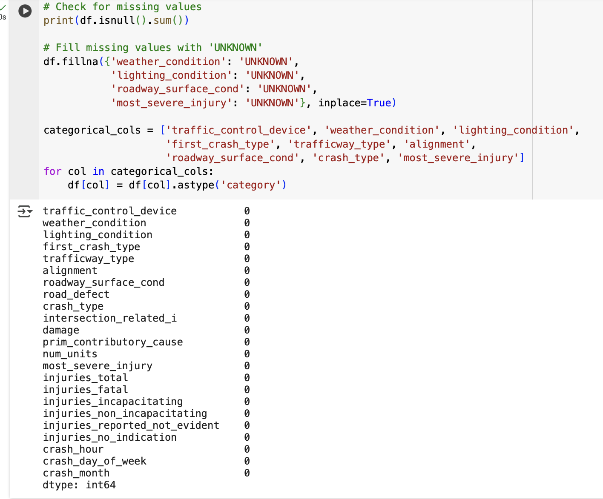
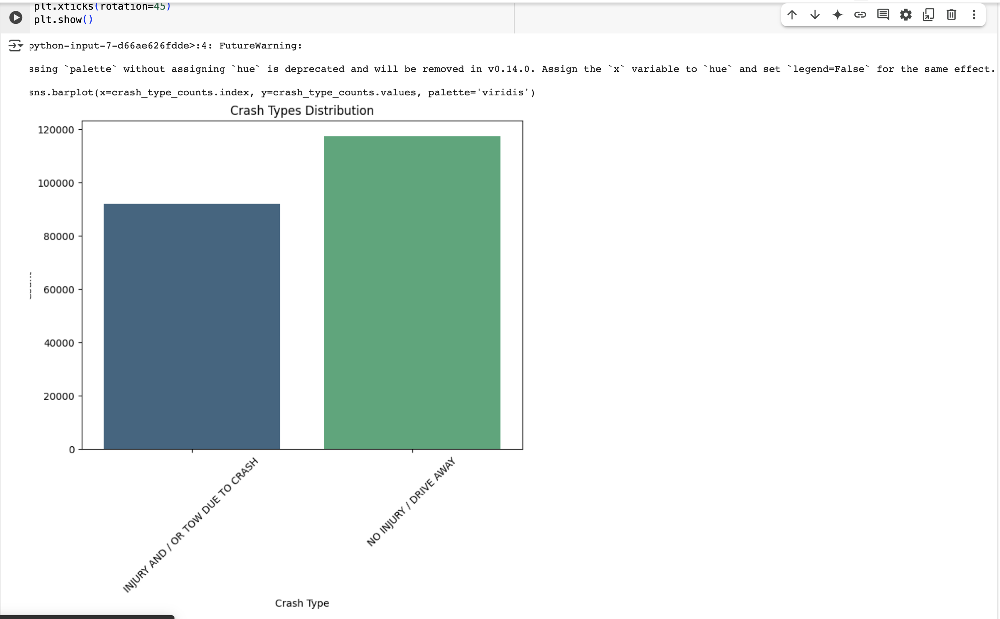
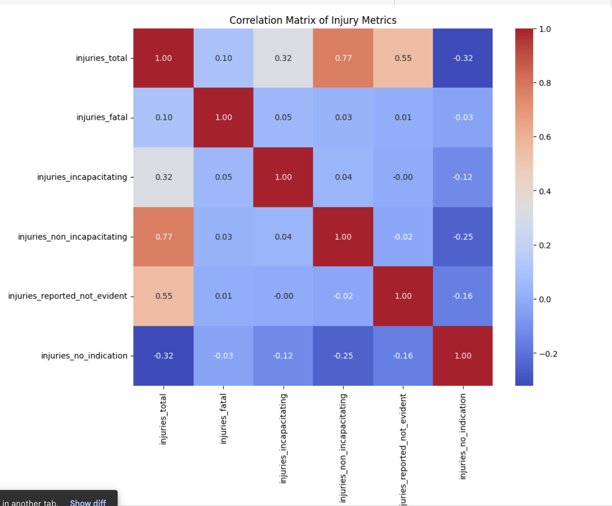

# Presentation: Traffic Accident Analysis Using Python

## Slide 1: Title Slide

- **Title:** Traffic Accident Analysis Using Python
- **Subtitle:** Exploring Patterns, Trends, and Insights in Traffic Accident Data
- **Presented By:** Youhem Rouainia

## Slide 2: Introduction

- **Objective:**
  - Analyze traffic accident data to uncover patterns and trends.
  - Visualize key insights using Python libraries such as Pandas, Matplotlib, and Seaborn.

- **Dataset Overview:**
  - **File:** `traffic_accidents.csv`
  - **Columns:** Includes crash types, weather conditions, lighting conditions, injury severity, and more.

- **Key Questions:**
  1. What are the most common crash types?
  2. How do weather and lighting conditions affect crashes?
  3. What is the distribution of injuries across accidents?
  4. Are there specific times or days with higher crash rates?

## Slide 3: Data Preprocessing

- **Steps Taken:**
  1. **Data Loading:**
     - Used `pandas.read_csv()` to load the dataset.
     - Handled encoding issues with `unicode_escape`.
  2. **Missing Values:**
     - Checked for missing values using `df.isnull().sum()`.
     - Filled missing categorical values with 'UNKNOWN' using `fillna()`.



  3. **Categorical Conversion:**
     - Converted relevant columns (e.g., `weather_condition`, `crash_type`) to categorical data types for efficient analysis.

## Slide 4: Crash Types Distribution

- **Visualization:** Bar Chart showing the distribution of crash types.



- **Insights:** Example: "Rear-end collisions account for the majority of crashes."



```python
crash_type_counts = df['crash_type'].value_counts()
sns.barplot(x=crash_type_counts.index, y=crash_type_counts.values, palette='viridis')
plt.title('Crash Types Distribution')
plt.show()
