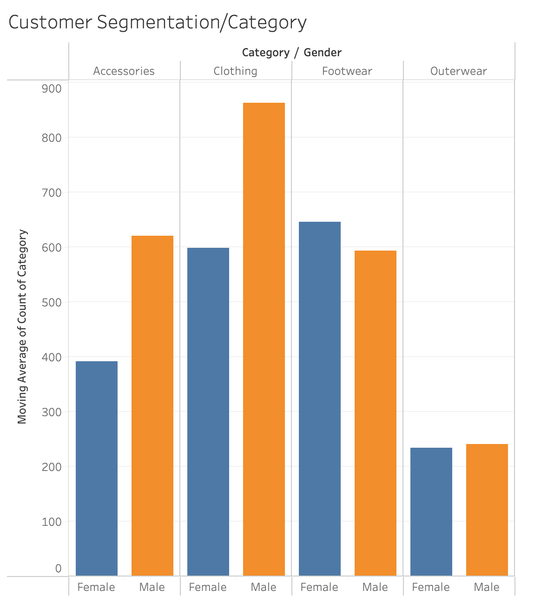
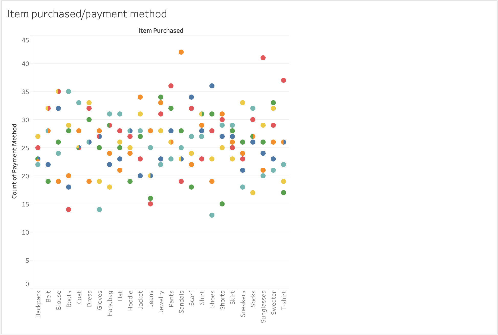
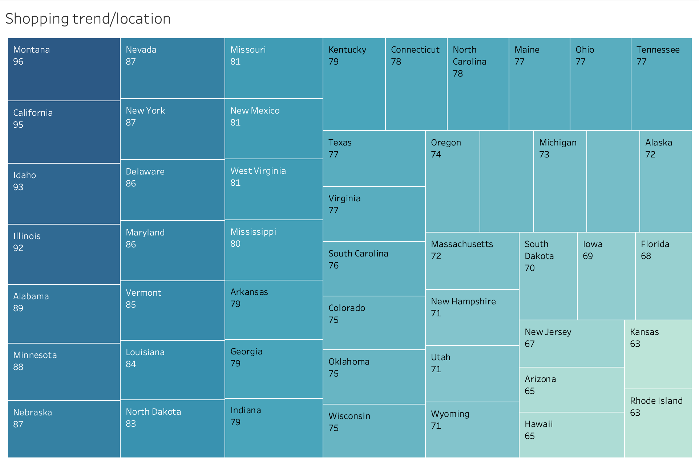

# Retail Business Insights and Trends

## Subtitle: Analysing Shopping Patterns and Customer Behaviour

### Presenter: Youhem Rouainia

---

## Slide 2: Introduction

### Purpose:
- Overview of the retail business trends and customer shopping behaviour.

### Objective:
- To provide insights into customer preferences, seasonal trends, and purchasing patterns.

---

## Slide 3: Customer Segmentation and Category Preferences

### Visual:
- **Bar Chart**: Moving average of count of category by gender.

  
  

### Insights:
- Discuss the preferences of male and female customers across different categories like clothing, footwear, accessories, and outerwear.
- Highlight which categories are more popular among each gender.

---

## Slide 4: Previous Purchase Analysis

### Visual:
- **Bar Chart**: Count of previous purchases by category.

### Insights:
- Analyse the frequency of purchases in each category.
- Identify which categories have the highest repeat purchase rates.

---

## Slide 5: Category Trends and Review Ratings

### Visual:
- **Line Graph**: Trends across categories.
- **Scatter Plot**: Item purchased by payment method.

  
  

### Insights:
- Discuss the overall trends in different categories.
- Explore how review ratings and previous purchases influence shopping trends.
- Analyse payment methods and their correlation with item types and gender.

---

## Slide 6: Seasonal Shopping Trends

### Visual:
- **Stacked Bar Chart**: Count of items purchased by season.

### Insights:
- Discuss how shopping behaviour changes across different seasons (Fall, Spring, Summer, Winter).
- Highlight peak shopping times and popular items in each season.

---

## Slide 7: Geographical Shopping Trends

### Visual:
- **Heatmap**: Shopping trends by location.

  

### Insights:
- Analyse how shopping trends vary by geographical location.
- Identify regions with high and low shopping activity.

---

## Slide 8: Product Category Shopping Trends by Gender

### Visual:
- **Bar Chart**: Count of purchase amount by gender and item purchased.

### Insights:
- Compare the purchasing behaviour of male and female customers across various product categories.
- Highlight the most and least popular items purchased by each gender.

---

## Slide 9: Conclusion

### Summary:
- Recap of key insights and trends observed in the data.

### Recommendations:
- Suggestions for targeted marketing strategies, inventory management, and customer engagement based on the insights.

---

## Final Deliverable:

This Python script provides a comprehensive overview of retail business data through systematic preprocessing and insightful visualizations. It lays the groundwork for deeper analysis and actionable recommendations to improve customer engagement and optimize inventory management.

**Key Takeaways:**
- The code successfully combines data cleaning, exploratory analysis, and visualization to uncover meaningful patterns in retail shopping data.
- Insights from this analysis can guide strategic decisions in marketing, product placement, and customer experience enhancement.
