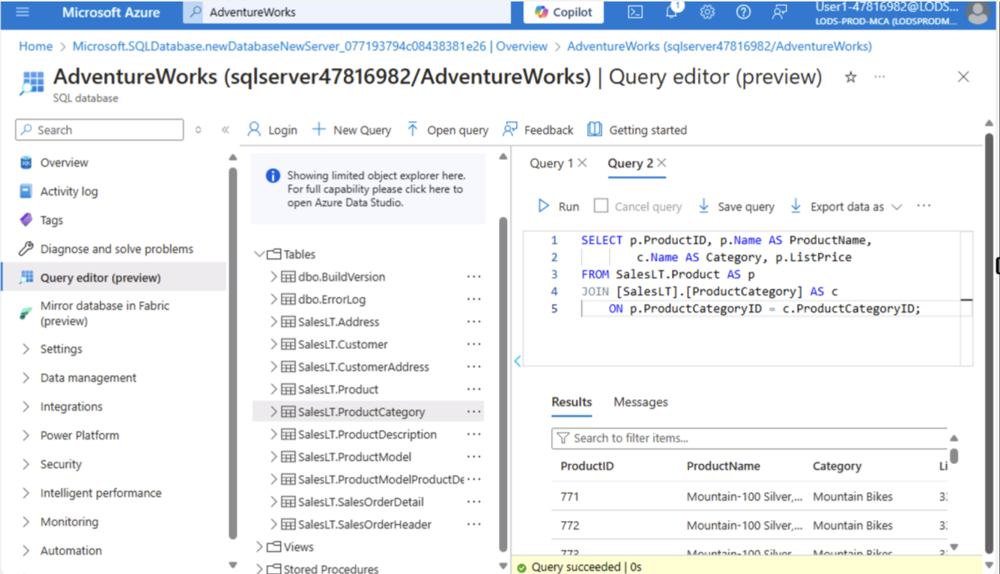
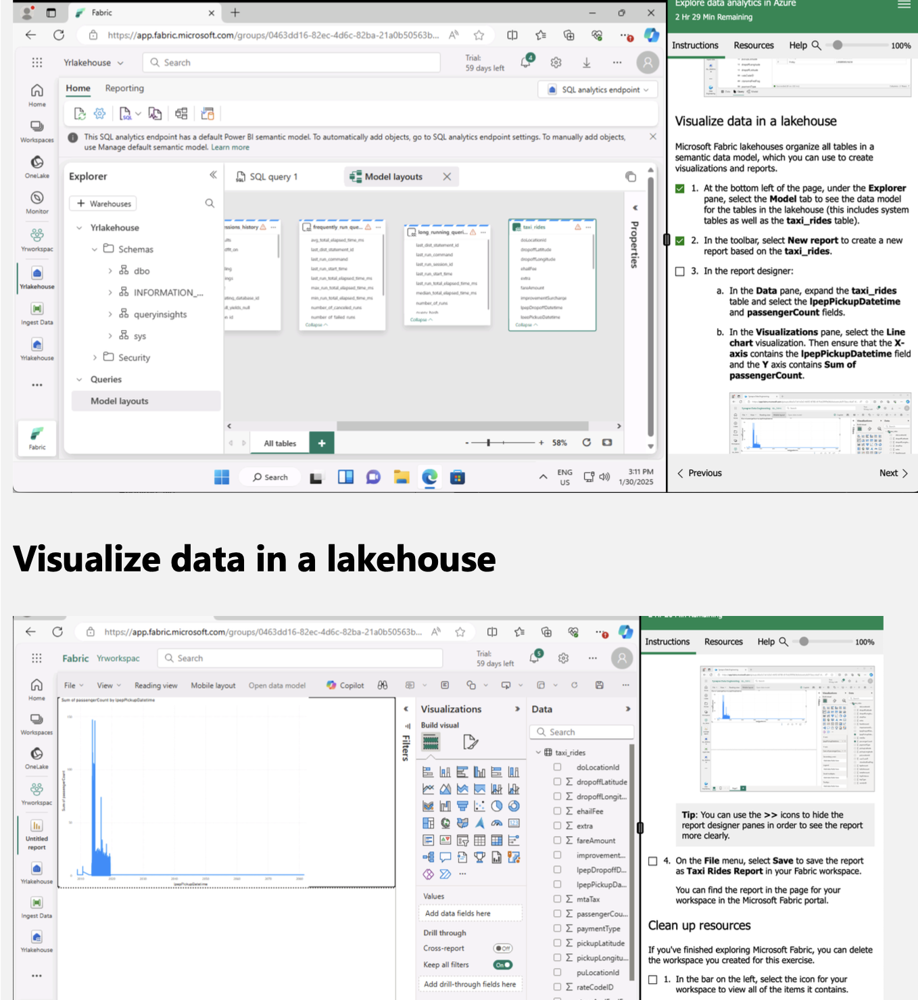

# Exploring Cloud-Based Solutions with Microsoft Azure

This workbook provides an in-depth exploration of key topics essential for understanding and implementing effective cloud-based solutions using Microsoft Azure. The focus is on four critical areas: Azure Service Recommendations, Data Types and Data Modelling, and Data Storage Formats and Structures in Azure.

## Cloud Computing and Related Concepts

### Explore Non-Relational Data in Azure

- **Lab Overview:**
  - Focus on working with non-relational (NoSQL) data using Azure Cosmos DB.
  - Explore Cosmos DB features such as document storage, partitioning, and indexing.

- **Outcome:**
  - Gained hands-on experience with NoSQL databases and their capabilities in handling unstructured/semi-structured data.

### Explore Data Analytics in Azure

- **Lab Overview:**
  - Create a workspace for data analytics using Azure Synapse Analytics or similar tools.
  - Perform data ingestion into a Lakehouse.
  - Query the Lakehouse using SQL analytics endpoints.
  - Visualize data using built-in visualization tools.

- **Key Activities:**
  1. **Workspace Creation:** Set up an environment for analytics workflows.
  2. **Data Ingestion:** Load data into a Lakehouse from various sources.
  3. **Query Execution:** Use SQL analytics endpoints to query the ingested data.
  4. **Data Visualization:** Create visualizations to derive insights from the data.

- **Outcome:**
  - Successfully demonstrated an end-to-end data analytics pipeline in Azure.

## Key Takeaways

- **Relational Data:**
  - Azure provides robust tools for managing and querying structured data.

- **Non-Relational Data:**
  - Cosmos DB is a powerful service for handling unstructured and semi-structured data.

- **Data Analytics:**
  - Azure Synapse Analytics and lake houses enable scalable data ingestion, querying, and visualization.

- **Overall Learning:**
  - Hands-on experience with Azure's diverse data services for different types of data and use cases.
  - These skills are essential for modern data technicians to manage, analyze, and derive insights from various data types effectively.

## Writing a Report for "Paws & Whiskers"

### Scenario Background

- **Contextual Understanding of Use Cases:**
  - Evaluate your organization's data governance policies.
  - Explore Azure services that align with your business goals.
  - Continuously refine data models and storage strategies as requirements evolve.

### Compliance with Data Laws and Regulations

- **Azure Service Recommendations:**
  - Blob Storage, Synapse Analytics, Data Factory.

- **Data Modelling:**
  - Storage Formats: Aggregated data.
  - Security and Scalability: Star schema with fact and dimension tables.
  - CSV, JSON, Parquet for structured, semi-structured, and unstructured data.
  - Encryption, role-based access, and scalable storage solutions.

### Key Takeaways from the Report

- **Compliance with Data Laws:** Critical for protecting sensitive information.
- **Azure Services:** Wide range of services tailored to specific data needs.
- **Proper Data Modelling:** Ensures efficient storage and retrieval.
- **Storage Format and Structure:** Optimizes performance and cost.

By adopting Azure, "Paws & Whiskers" can achieve operational excellence and drive sustainable growth!

## Summary

- **Compliance with Data Laws:** Critical for protecting sensitive information.
- **Azure Services:** Wide range of services tailored to specific data needs.
- **Proper Data Modelling:** Ensures efficient storage and retrieval.
- **Choosing the Right Storage Format and Structure:** Optimizes performance and cost.
