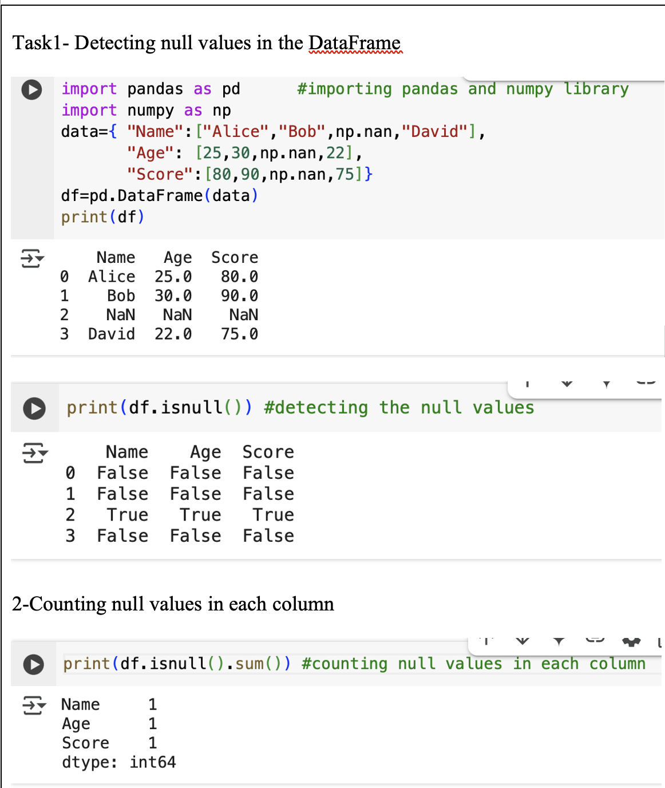
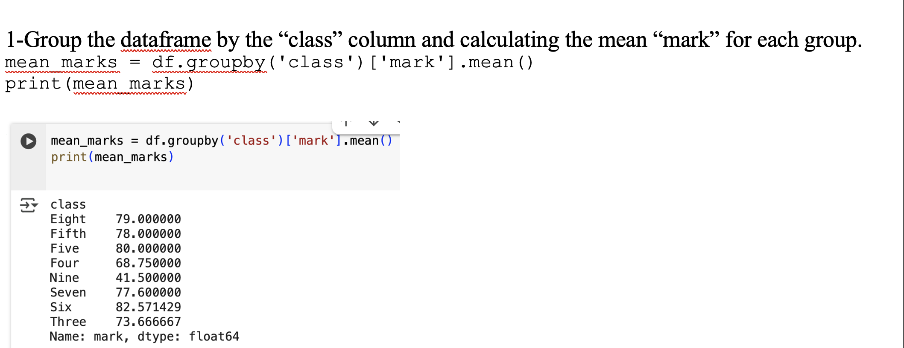
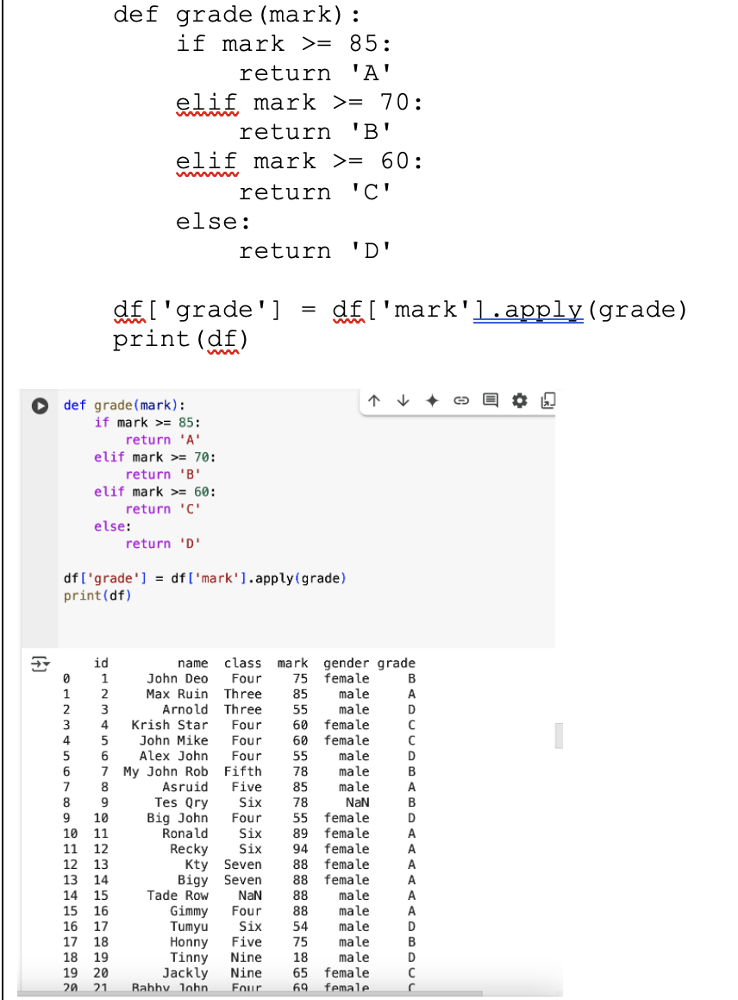
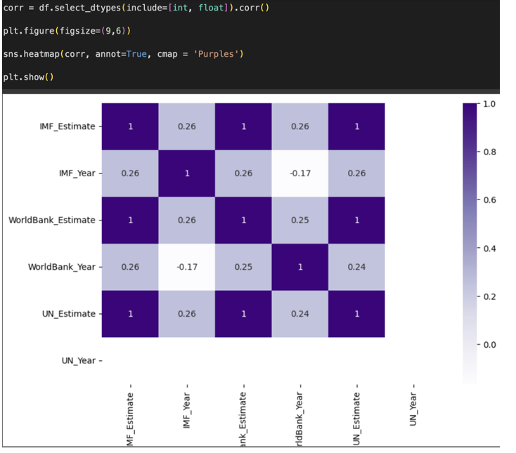

# Data Handling and Programming Tasks Workbook

This workbook provides hands-on experience with essential data handling and programming tasks. By completing the exercises, I gained practical skills in Python, Pandas, and data visualization, which are critical for a data technician role.

## Key Skills Developed

1. **Programming Skills:**
   - Demonstrated proficiency in implementing logic (e.g., FizzBuzz) and data manipulation using Python.

2. **Data Analysis:**
   - Practiced loading, exploring, manipulating, and visualizing datasets using Pandas and Matplotlib.
   - Applied these skills to analyze student performance and GDP data, preparing for real-world data technician roles.

## Real-World Application: Key Takeaways

1. **Data Cleaning:**
   - Null values can significantly impact analysis and must be handled appropriately (removal, filling, or replacement).

2. **Group Operations:**
   - Grouping data by regions or categories allows for deeper insights into trends and comparisons.

3. **Statistical Analysis:**
   - Calculating averages, maxima, minima, and counts helps summarize large datasets effectively.

4. **Visualization:**
   - **Histograms and Heatmaps:** Provide intuitive ways to understand data distributions and relationships.
   - **Bar Plots:** Highlight regional disparities and trends.

5. **Practical Application:**
   - The GDP dataset serves as a real-world example for practicing data manipulation and analysis techniques.

## Conclusion

This workbook equips me with essential skills for handling missing data, performing statistical analysis, and creating meaningful visualizations. By working through these tasks, I gained hands-on experience with Python tools and techniques, enabling me to tackle similar challenges in my own projects. The focus on GDP data provides a practical context for applying these skills, making the learning process both engaging and impactful.
